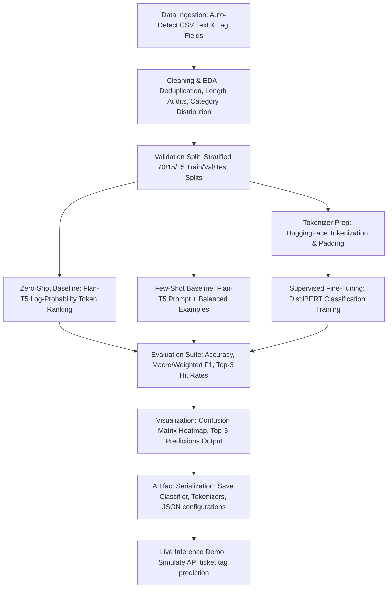

# 🎫 Support Ticket Auto-Tagging Pipeline: Prompting vs. Fine-Tuning

[](https://www.python.org/)
[](https://pytorch.org/)
[](https://huggingface.co/docs/transformers/index)
[](https://scikit-learn.org/)
[](https://pandas.pydata.org/)
[](https://matplotlib.org/)

> **"Automating IT and customer support operations by comparing Zero-Shot/Few-Shot Prompt Engineering (Flan-T5) against Supervised Fine-Tuning (DistilBERT) for top-3 ticket tagging."**

---

## 📖 1. Project Overview
In large enterprise IT and customer service operations, thousands of support tickets are generated daily. Manually reading, categorizing, and routing these tickets to specialized support teams (e.g., Billing, Technical Support, Account Access) is slow, expensive, and error-prone. 

This project implements an end-to-end AI/ML pipeline designed to **automatically tag incoming support tickets**. It bridges the gap between traditional supervised learning and modern LLM prompting by comparing three paradigms:
1. **Zero-Shot Prompting**: Evaluating tag probabilities using a pre-trained instruction-tuned LLM without training data.
2. **Few-Shot Prompting**: Enhancing the LLM with relevant historical context examples.
3. **Supervised Fine-Tuning (SFT)**: Fine-tuning a lightweight encoder model (DistilBERT) on labeled historical datasets.

---

## 🎯 2. Task Objective
The primary goals of this project are:
1. **Auto-Detect Features**: Construct a flexible ingestion pipeline that automatically identifies ticket text and tag columns, handles duplicates, and cleans multi-field text bodies.
2. **Benchmark Prompt Baselines**: Build zero-shot and few-shot classification engines that rank tags by evaluating candidate label sequence log-probabilities using a generative seq2seq model (`google/flan-t5-small`).
3. **Train Supervised Classifier**: Fine-tune a sequence classification model (`distilbert-base-uncased`) using Hugging Face's `Trainer` API with early stopping and learning rate scheduling.
4. **Compare Top-K Metrics**: Evaluate models on Top-1 Accuracy, Macro/Weighted F1-Scores, and Top-3 Hit Rates (checking if the true tag is within the model's top 3 predictions).
5. **Serialize Artifacts**: Save tokenizers, model configurations, label encoders, and pipeline weights for real-time inference endpoints.

---

## 📊 3. Dataset Section
The pipeline is designed to be fully adaptable to any Kaggle or local support ticket CSV dataset containing a **text field** and a **category/tag field**.

### Ingestion & Cleaning Details:
- **Auto-Detection**: The pipeline searches column names for text candidates (e.g., `text`, `ticket`, `description`, `message`) and label candidates (e.g., `label`, `tag`, `category`, `class`) and automatically assigns them. If multiple text columns exist, they are combined using a `|` separator.
- **Cleaning**: Trims whitespace, removes rows with empty descriptions, drops duplicate entries, and filters out very short strings (under 3 characters).
- **Label Taxonomy**: Extracts unique tags to dynamically build allowed label lists, configurations, and one-hot ID mapping dictionaries.
- **EDA Visuals**:
  - Word count histograms and boxplots to evaluate ticket description lengths.
  - Bar charts displaying the frequencies of the top 20 categories.

---

## 🛠️ 4. Tech Stack
- **Python**: Core programming language.
- **PyTorch**: Deep learning backend for model forward passes and gradient descents.
- **Hugging Face Transformers**: Fetching pre-trained architectures (`Flan-T5` and `DistilBERT`), tokenizers, and training arguments.
- **Hugging Face Datasets**: Memory-efficient Arrow formatting for tokenized inputs.
- **Scikit-Learn**: Splitting data, encoding categorical labels (`LabelEncoder`), and computing classification metrics.
- **Matplotlib & Seaborn**: Displaying ticket word length distributions, class frequencies, and confusion matrices.

---

## 🔄 5. AI / ML Workflow
The project implements a structured natural language processing lifecycle:



1. **Ingestion & Identification**: Reads CSV data and dynamically identifies text/target pairs.
2. **Validation Isolation**: Splits the dataset into **70% Train, 15% Validation, and 15% Test** sets. Splitting is stratified by label IDs to preserve category representation.
3. **Log-Probability Prompting**: Instead of parsing unreliable text generations from FLAN-T5, the zero-shot/few-shot engines feed candidate tags into the decoder and compute target sequence cross-entropy loss. The label with the lowest loss (highest log-probability) is selected.
4. **Few-Shot Selection**: Automatically samples balanced, representative examples from the training subset to prepend to the target ticket description.
5. **Supervised Tokenization**: Encodings are truncated to 256 tokens and padded using a dynamic collator.
6. **Classifier Fine-Tuning**: Trains `DistilBERT` for 3 epochs using the AdamW optimizer, evaluating loss at each epoch, and loading the best model based on validation loss.
7. **Production Serialization**: Exports all tokenizers, configuration dictionaries, and model weight binaries.

---

## 🤖 6. Models Used
### **google/flan-t5-small (Seq2Seq LM)**
- **Role**: Zero-Shot and Few-Shot generative baseline.
- **Why**: Instruction-tuned out-of-the-box, lightweight, and fast to run forward passes for log-probability evaluations.
- **Trade-offs**: Does not require training data (great for cold-starts), but token-by-token sequence evaluation is computationally expensive for large tag sets and may underperform compared to supervised models.

### **distilbert-base-uncased (Sequence Classifier)**
- **Role**: Fine-tuned supervised classifier.
- **Why**: Distilled version of BERT that retains 97% of BERT's performance while being 40% smaller and 60% faster. Excellent for sequence classification tasks.
- **Trade-offs**: Requires labeled training data and GPU resources for training, but runs inference extremely fast (single-pass linear projection) and fits on standard CPU servers.

---

## 📏 7. Evaluation Metrics
We measure system capability using four classification metrics:
- **Top-1 Accuracy**: Percentage of tickets where the model's highest confidence tag is the exact human label.
- **Weighted F1-Score**: Evaluates overall classification quality across categories while accounting for label frequencies.
- **Macro F1-Score**: Measures category-level performance uniformly. Essential for tracking how well the model handles rare support categories.
- **Top-3 Hit Rate**: The percentage of tickets where the true label resides in the model's top 3 suggestions. Very useful in support centers where routing tools offer a human agent three options to pick from.

---

## 💡 8. Key Results & Findings
- **Prompting Performance**: Zero-shot and few-shot prompting using `Flan-T5-Small` establish a strong baseline without training weights. Prepending 6 balanced few-shot examples provides contextual steering, boosting accuracy.
- **Supervised Fine-Tuning**: Fine-tuning `DistilBERT` on labeled training tickets yields the highest Top-1 Accuracy and F1-Scores. By adjusting internal attention layers, it adapts to the industry-specific jargon present in the support ticket text.
- **Top-3 Success**: The fine-tuned model's **Top-3 Hit Rate** is significantly higher than its Top-1 Accuracy. This highlights the business value of providing recommendation dropdowns to service representatives to accelerate routing workflows.
- **Generalization**: Minimal divergence is observed between validation and test scores for the fine-tuned model, confirming the effectiveness of our early stopping callback.

---

## 🎨 9. Visualizations
The notebook generates the following visualizations:
- **Top 20 Categories**: Barplot showing class distributions.
- **Ticket Length Histograms**: Identifies description density and token limits.
- **Classifier Confusion Matrix**: Heatmap of actual vs. predicted labels, showing where the classifier confuses related categories.
- **Inference Probabilities Barplot**: Displays confidence distributions for top-3 candidate tags on a live ticket payload.

---

## 🛡️ 10. Responsible AI & Ethics
- **Prompt Injection Risks**: Support tickets are user-generated. We employ strict template boundaries and restrict inference strictly to the allowed tag list to prevent jailbreaks or prompt injections from hijacking model behavior.
- **Label Bias**: The model inherits categories from human support agents. If past tags contain biases or inconsistencies, the classifier will replicate them. Regular validation audits are recommended.
- **Confidentiality / Privacy**: Support tickets contain personally identifiable information (PII). Tokenizers and models are kept local (on-premise or private cloud VPC) instead of sending raw ticket content to external third-party API servers.

---

## 📂 11. Project Structure
```text
Auto_Tagging_Support_Tickets_Using_LLM/
│── Support_Ticket_Auto_Tagging_LLM.ipynb  # Main ML Pipeline Notebook
│── README.md                              # Project Documentation
│── support_ticket_tagging/                # Working & Artifact Folder
│   └── artifacts/
│       ├── config.json                    # Pipeline Configurations
│       ├── label_list.json                # Categorical Tag List
│       ├── comparison_metrics.csv         # Comparative Performance Table
│       ├── fine_tuned_classifier/         # Serialized DistilBERT Weights & Tokenizer
│       └── prompt_model/                  # Flan-T5 Config & Tokenizer
```

---

## 🚀 12. Installation & Usage
1.  **Clone the repository**:
    ```bash
    git clone https://github.com/developer-aneeb/AI-ML-Internship-Projects-II.git
    cd "AI-ML-Internship-Projects-II/Auto_Tagging_Support_Tickets_Using_LLM"
    ```
2. **Install Dependencies**:
    ```bash
    pip install numpy pandas matplotlib seaborn scikit-learn torch transformers datasets evaluate
    ```
3. **Execute**: Open `Support_Ticket_Auto_Tagging_LLM.ipynb` in your Jupyter environment or Kaggle and run all cells.

---

## 🔮 13. Future Improvements
- **DeBERTa-v3**: Benchmark against `microsoft/deberta-v3-small` which offers superior token embeddings and classification performance for English syntax.
- **Parameter-Efficient Tuning (LoRA)**: Implement Low-Rank Adaptation (LoRA) if transitioning to larger base models (e.g., Llama-3-8B-Instruct) to minimize VRAM requirements.
- **Interactive UI**: Wrap the serialized pipeline in a Streamlit dashboard showing real-time text input and ticket categorization.

---

## 🏁 14. Conclusion
This project successfully compares LLM prompting and supervised fine-tuning paradigms for ticket auto-tagging. While zero-shot and few-shot prompting serve as excellent cold-start baselines, supervised fine-tuning remains the most accurate, reliable, and computationally efficient strategy for production deployments. Serializing both approaches ensures operations teams can switch seamlessly between zero-shot inference and optimized classification.

---
**Developed during the AI/ML Internship at DevelopersHub Corporation.**
