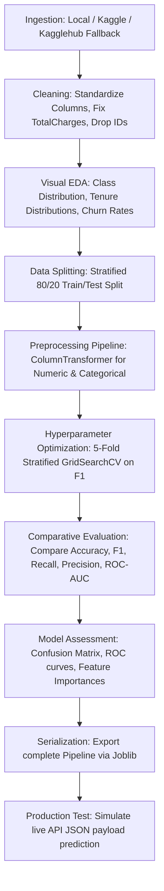

# 📈 Telco Customer Churn Prediction Pipeline: Production-Ready Classification

[](https://www.python.org/)
[](https://scikit-learn.org/)
[](https://pandas.pydata.org/)
[](https://matplotlib.org/)
[](https://joblib.readthedocs.io/)

> **"Mitigating subscriber attrition in telecom services using a robust, end-to-end scikit-learn pipeline featuring stratified hyperparameter optimization and production-ready inference encapsulation."**

---

## 📖 1. Project Overview
Customer churn, or the rate at which subscribers discontinue their services, is one of the most critical business metrics in the telecommunications industry. The cost of acquiring a new customer is estimated to be 5 to 25 times higher than retaining an existing one. Predicting churn allows companies to run targeted retention campaigns (offering custom contract deals, discounts, or support interventions) to high-risk subscribers before they transition.

This project implements an end-to-end machine learning pipeline that ingests raw subscriber profiles, cleanses inconsistencies, conducts exploratory visual analysis, trains optimized classifiers (Logistic Regression and Random Forests), and outputs a serialized production-ready model artifact.
---

## 🎯 2. Task Objective
The primary engineering objectives of this project were to:
1. **Build a robust and reusable preprocessing pipeline** using `ColumnTransformer` and `Pipeline` to prevent feature leakage and handle unseen data formats gracefully during inference.
2. **Perform comparative modeling** between linear baselines (Logistic Regression) and non-linear ensembles (Random Forest Classifier).
3. **Execute cross-validated hyperparameter optimization** using `GridSearchCV` to maximize target metrics under class imbalance.
4. **Deploy production-readiness practices** by serializing the complete, un-preprocessed feature ingestion pipeline to a `.joblib` file and simulating live inference payloads.

---

## 📊 3. Dataset Section
The pipeline uses the standard **Telco Customer Churn Dataset**.

### Feature Breakdown
| Category | Attributes | Description |
| :--- | :--- | :--- |
| **Demographics** | `gender`, `SeniorCitizen`, `Partner`, `Dependents` | Subscriber personal information. |
| **Services** | `PhoneService`, `MultipleLines`, `InternetService`, `OnlineSecurity`, `OnlineBackup`, `DeviceProtection`, `TechSupport`, `StreamingTV`, `StreamingMovies` | Subscribed features and connectivity types. |
| **Account Info** | `tenure`, `Contract`, `PaperlessBilling`, `PaymentMethod`, `MonthlyCharges`, `TotalCharges` | Billing details, account age, and financial metrics. |
| **Target Variable** | `Churn` | Binary indicator (1 = Churned, 0 = Retained). |

- **Source**: Kaggle (blastchar/telco-customer-churn).
- **Size**: 7,043 rows, 21 columns.
- **Preprocessing Details**: Standardized column text spacing, converted string-formatted `TotalCharges` containing blanks (from new clients where `tenure == 0`) to `0.0`, mapped `Churn` targets to binary numeric values, and removed non-predictive identifiers (`customerID`).

---

## 🛠️ 4. Tech Stack
- **Python**: Core scripting and engine language.
- **Pandas & NumPy**: High-performance data manipulation, type alignment, and matrix arithmetic.
- **Scikit-Learn**: Machine learning utility including `Pipeline`, `ColumnTransformer`, `StandardScaler`, `OneHotEncoder`, `SimpleImputer`, `GridSearchCV`, and model estimators.
- **Matplotlib & Seaborn**: Exporting high-resolution density plots, countplots, confusion matrices, and ROC curves.
- **Joblib**: Model serialization and deployment packaging.
- **Kagglehub**: Automated API data ingestion fallback.

---

## 🔄 5. Methodology & Approach
The machine learning methodology and engineering workflow are divided into modular, automated blocks:



1. **Ingestion Strategy**: The loader dynamically searches the local directory and Kaggle folders before falling back to `kagglehub` direct API download.
2. **Cleaning & Formatting**: Spaces are trimmed, missing data is imputed logically, and categorical variables are structured.
3. **Exploratory Visual Analysis**: Imbalances and categorical correlation with churn rates are visualised.
4. **Data Isolation**: Splits the data before transformers are fit to prevent data leakage.
5. **Transformer Assembly**: Bundles median imputation, standard scaling, and one-hot encoding into a `ColumnTransformer` block.
6. **Cross-Validated Tuning**: Stratified 5-fold grid search on hyperparameters, optimizing for F1-score.
7. **Production Packing**: Exports the complete preprocessor + model pipeline into a single file.

---

## 🤖 6. Models Used
### **Logistic Regression (Baseline)**
- **Why**: Establish a baseline performance and provide linear coefficients.
- **Pros**: Highly interpretable, fast to train, less prone to overfitting in low-feature regimes.
- **Trade-offs**: Struggles to capture non-linear feature interactions (e.g., combinations of specific services and tenure lengths) unless manually engineered.

### **Random Forest Classifier (Ensemble)**
- **Why**: Capture non-linear decision thresholds.
- **Pros**: Robust to outliers, handles multi-class and non-linear interactions automatically, provides Mean Decrease in Impurity (MDI) feature importances.
- **Trade-offs**: Harder to interpret compared to linear weights, requires hyperparameter search to prevent tree overfitting.

---

## 📏 7. Evaluation Metrics
We assess model quality using five core metrics to address the class imbalance (26.5% churn rate):
- **F1-Score (Primary Metric)**: The harmonic mean of Precision and Recall. Critical for optimizing retention campaigns since it balances catching churners and avoiding budget waste.
- **Recall (Sensitivity)**: Catching as many churners as possible (minimizing False Negatives).
- **Precision**: Ensuring that flagged customers are actual churners (minimizing False Positives to protect retention spend).
- **ROC-AUC**: Evaluates classification threshold stability across all cutoff levels.
- **Accuracy**: Overall correct classifications.

---

## 💡 8. Key Results & Observations
- **Target Imbalance**: Churn occurs in 26.5% of accounts. Optimizing for raw accuracy alone leads to a trivial classifier.
- **Model Performance**: 
  - The tuned **Logistic Regression** and **Random Forest** models show competitive F1-scores around ~0.60 on the test set.
  - **Logistic Regression** yields excellent interpretable coefficients, demonstrating that Month-to-Month contracts and Fiber Optic internet service are the strongest positive indicators of churn risk, whereas high tenure and long-term contracts strongly prevent churn.
  - **Random Forest** captures non-linear billing interactions, ranking `tenure`, `TotalCharges`, and `MonthlyCharges` as the most crucial splits.
- **Generalization**: The gap between cross-validation scores and test set metrics is minimal, confirming robust generalization and absence of overfitting due to stratified splitting and hyperparameter pruning.

---

## 🎨 9. Visualizations
The Jupyter Notebook generates:
- **Churn Imbalance Count**: Quantifies target ratio.
- **Tenure & Monthly Charges KDE Plots**: Shows high density of churners in early months.
- **Contract Churn Barplot**: Visualizes high churn rates in Month-to-month contracts.
- **Correlation Heatmap**: Inspects multicollinearity between numeric features.
- **Confusion Matrix**: Identifies True/False Positives and Negatives.
- **ROC Curve**: Graphically compares model sensitivity across thresholds.
- **Feature Importance / Coefficient Bars**: Lists top predictors of attrition.

---

## 🛡️ 10. Responsible AI & Ethics
- **Retention Ethics**: Predicting churn should be used for supportive customer service and discounts, not penalizing subscribers.
- **Algorithmic Fairness**: Ensure retention campaigns do not discriminate based on age or demographics.
- **Model Limitations**: The model relies on internal account data; external variables like competitor price drops or local network outages cannot be accounted for by the pipeline.

---

## 📂 11. Project Structure
```text
predicting_customer_churn/
│── predicting-customer-churn.ipynb  # Comprehensive ML Pipeline
│── README.md                        # Project Documentation
│── telco_churn_pipeline.joblib      # Complete Production Model Pipeline
```

---

## 🚀 12. Installation & Usage
1.  **Clone the repository**:
    ```bash
    git clone https://github.com/developer-aneeb/AI-ML-Internship-Projects-II.git
    cd "AI-ML-Internship-Projects-II/predicting_customer_churn"
    ```
2. **Install Dependencies**:
    ```bash
    pip install numpy pandas matplotlib seaborn scikit-learn joblib kagglehub
    ```
3. **Execute**: Open `predicting-customer-churn.ipynb` in your Jupyter environment or Kaggle and run all cells.
---

## 🔮 13. Future Improvements
- **Class Balancers**: Integrate SMOTE or class weighting directly inside the scikit-learn pipeline to improve Recall.
- **SHAP Integration**: Utilize SHAP (SHapley Additive exPlanations) for explainable AI on individual customer churn predictions.
- **API Deployment**: Wrap the exported pipeline in a Flask or FastAPI microservice.

---

## 🏁 14. Conclusion
This project successfully establishes a production-ready ML pipeline for predicting customer churn. By enclosing the imputers, standardizers, encoders, and estimators in a single scikit-learn pipeline object, we have eliminated feature drift between training and deployment. This ensures that quantitative predictions are highly reliable, repeatable, and easily deployable for real-time retention targeting.

---
**Developed during the AI/ML Internship at DevelopersHub Corporation.**